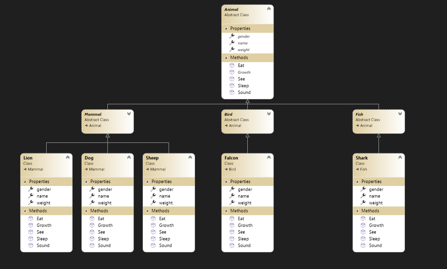
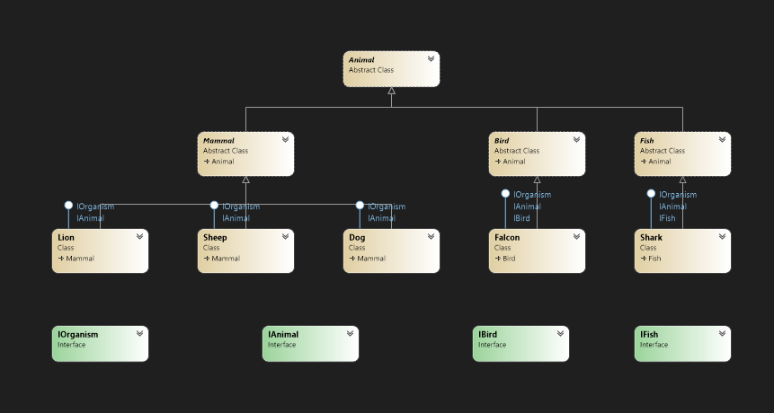

# Lab-Zoo

## **Introduction** 

Zoo application. You want to describe the animals at the zoo. All animals have some basic similarities. Since this is a zoo application, you can consider Animal as the top layer class that describes all the animals at the zoo. Each animal has its own characteristics, but even with these distinct characterizations, they're still animals.

With the main parent Animal class, you can then drill down into the animals themselves. You can have a shark and a lion class. Both of these classes would derive from the animal class, but they have their own property. They could inherit Eat, sleep, , and Sound but these characteristics would need their own properties. Within the Shark and Lion class, you derive these main characteristics but you define them individually in your classes.

These concepts are the main ideas behind inheritance. Your classes all inherit from one main class. Put these classes together and have zoo application.
## **Class Inheritance**

Now that we have a brief explanation of classes, we can discuss inheritance. We used the Animal class as an example in the previous section. The Lion class derived from the Animal class, because a Lion is an animal. The same was said of the Shark class. Although a shark is not the same animal as a lion , they are still both animals. When you work with classes and inheritance, the Animal class is said to be the parent class. The Lion and Shark classes are said to derive from Animal, and they are considered child classes.

Let's first take a look at an example of an Animal parent class.

```C#
public abstract class Animal
{
    
        public abstract string name { get; set; }
        public abstract string gender { get; set; }
        public abstract double weight { get; set; }

        public virtual string Sound()
        {
            return "All animals have sound";
        }

        public virtual string Eat()
        {
            return "All animals can eat";
        }

        public virtual string Sleep()
        {
            return "All animals need to sleep";
        }

        public virtual bool See()
        {
            return true;
        }
        public abstract string Growth();
}
```
We then create three methods that are a part of all animals. All animals can see, Sleep and Growth. Notice that the all member method has the virtual modifier. The virtual modifier allows us to override the function in the child class.

We have our parent class, and now we can start inheriting from it with child classes. First, let's make a lion class and inherit from Animal.

```C#
public abstract class Animal
{
    
        public abstract string name { get; set; }
        public abstract string gender { get; set; }
        public abstract double weight { get; set; }

        public virtual string Sound()
        {
            return "All animals have sound";
        }

        public virtual string Eat()
        {
            return "All animals can eat";
        }

        public virtual string Sleep()
        {
            return "All animals need to sleep";
        }

        public virtual bool See()
        {
            return true;
        }
        public abstract string Growth();
}

public abstract class Mammal : Animal
{
         public void Skin()
        {
            Console.WriteLine("All Mammal have Skin");
        }
}

public class Lion : Mammal , IOrganism,IAnimal
    {

        public override string name{get;set;}

        public override string gender { get; set; }

        public override double weight { get; set; }

        public override string Sound()
        {
            return "Roars";
        }

        public override string Sleep()
        {
            return "Sleep 12 hours";
        }

        public override string Eat()
        {
            return "Meat";
        }

        public override bool See()
        {
            return true;
        }

        public override string Growth()
        {
            return "growth";
        }
    }
```

We copied our Animal class, and now we have a Lion class. The "Lion : Animal" notation indicates that we want Lion to inherit from the Animal class. The format for inheritance is always ,child class : parent class.

## **Polymorphism**

Polymorphism is another part of OOP, and we saw some of it in the last chapter. Polymorphism allows your objects to perform differently depending on certain factors. These factors can be input from a user, input from the program, or input from the environment. Polymorphism is done in two ways: overloading or overriding a method. We covered overloading methods in the last chapter, but we'll cover overriding in this chapter. We'll also review overloading again, so you get a full overview of polymorphism and how can use it in programs.

You might wonder why we chose to use the virtual modifier on the Sound method . Part of software development is also engineering great code and understanding the way a program should function. We know that all animals speak, but we know that they speak differently. A lion roars and a hawk squawk . These differences must be reflected in your code, and since we want to derive both lion and falcon from the main animal class, we need to override the Sound method's basic function. We can do this by setting the method to virtual.

Let's take a look at how we can create a polymorphic Sound method that has two versions.
```C#
public abstract class Animal
{
        public virtual string Sound()
        {
            return "All animals have sound";
        }
}

public abstract class Mammal : Animal
{
    public void Skin()
    {
        Console.WriteLine("All Mammal have Skin");
    }
}

public abstract class Bird : Animal
{
    public void Feathers()
    {
        Console.WriteLine("All Birds have feathers");
    }
}

public class Lion : Mammal
{
    public override string Sound()
    {
        return "Roars";
    }
}

public class Falcon : Bird 
{
    public override string Sound()
    {
        return "Rasping";
    }
}
```

## **Abstraction**

An abstract class is an incomplete class or special class we can't be instantiated. The purpose of an abstract class is to provide a blueprint for derived classes and set some rules what the derived classes must implement when they inherit an abstract class.

Example for abstract class: 

```C#
public abstract class Animal
    {
        public abstract string name { get; set; }
        public abstract string gender { get; set; }
        public abstract double weight { get; set; }

        public virtual string Sound()
        {
            return "All animals have sound";
        }

        public virtual string Eat()
        {
            return "All animals can eat";
        }

        public virtual string Sleep()
        {
            return "All animals need to sleep";
        }

        public virtual bool See()
        {
            return true;
        }
        public abstract string Growth();
    }
```

## Abstract method

An Abstract method is a method without a body. The implementation of an abstract method is done by a derived class. When the derived class inherits the abstract method from the abstract class, it must override the abstract method. This requirment is enforced at compile time and is also called dynamic polymorphism.

Example for abstract class: 

```C#
public abstract class Animal
{
    public abstract string Growth();
}

public abstract class Mammal : Animal
{
    public void Skin()
    {
        Console.WriteLine("All Mammal have Skin");
    }
}

public class Lion : Mammal
{
    public override string Growth()
    {
        return "growth";
    }
}
```

## UML Digram for Zoo 




## Interface 

Interface is a blueprint of a class. It is like abstract class because all the methods which are declared inside the interface are abstract methods. It cannot have method body and cannot be instantiated.
It is used to achieve multiple inheritance which can't be achieved by class. It is used to achieve fully abstraction because it cannot have method body.

To understand the need for interfaces let’s do an example. Suppose we have a Dog class and a Shark class. Both can respiration and move and have some other characteristics. Now instead of writing all the code separately in both classes what we can do declare a class Organism and put all the common characteristics in that class and inherit both classes from this class because Dog and Parrot are living organisms and have all the characteristics of this class.

```C#
interface IOrganism
{
    string Respiration();
    string Movement();
}
```

Now we want to add some other characteristics of Dog and Sahrk:  that they are multicellular and warm-blooded. Because all the organisms are not multicellular and reproduce in same way we cannot add these characteristics in the Organism class. So we can declare a new interface IAnimal and put all the characteristics in this interface, and inherit both Dog and Shark classes from IAnimal class.

```C#
interface IAnimal
{
    string Multicellular();
    string Reproduce();
}
```

Now, what if we want to add some special characteristics of both Dog and Falcon classes? For example, Dog can run but Falcon  can fly. Dogs are heterotrophs and Birds are vertebrates. We may add these characteristics in both classes. But in the future, we may want to create another Bird class . 


```C#
interface IOrganism
{
    string Respiration();
    string Movement();
}

interface IAnimal
{
    string Multicellular();
    string Reproduce();
}
interface IBird
{
    string Fly();
    string Vertebrates();
    string WarmBlooded();
    string Wings();
    string Wings(string feathers);
}

public class Falcon : Bird ,IOrganism ,IAnimal ,IBird
{
    public string Respiration()
        {
            return "Respiration";
        }

        public string Movement()
        {
            return "fly";
        }

        public string Multicellular()
        {
            return "Multicellular";
        }

        public string Reproduce()
        {
            return "Reproduce";
        }

        public string Fly()
        {
            return "fly";
        }

        public string Vertebrates()
        {
            return "Vertebrates";
        }

        public string WarmBlooded()
        {
            return "WarmBlooded";
        }

        public string Wings()
        {
            return "Wings";
        }
        public string Wings(string feathers)
        {
            return "Wings";
        }
}

public class Dog : Mammal ,IOrganism,IAnimal
{
    public string Respiration()
        {
            return "Respiration";
        }

        public string Movement()
        {
            return "Run";
        }

        public string Multicellular()
        {
            return "Multicellular";
        }

        public string Reproduce()
        {
            return "Reproduce";
        }
}
```

## Interface UML Digram for Zoo 




## When to use Interface

- Interfaces can be used to provide common functionality in the classes or structures that are not related to each other.
- Interfaces are an alternative approach to multiple inheritances .
- Interfaces are used to group objects, based on their common behaviors.
- Interfaces are used to provide polymorphic behaviors to classes because they can implement more than one interface.